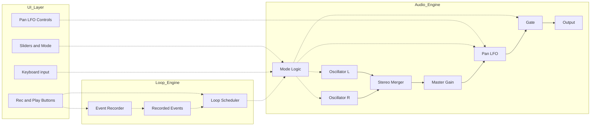
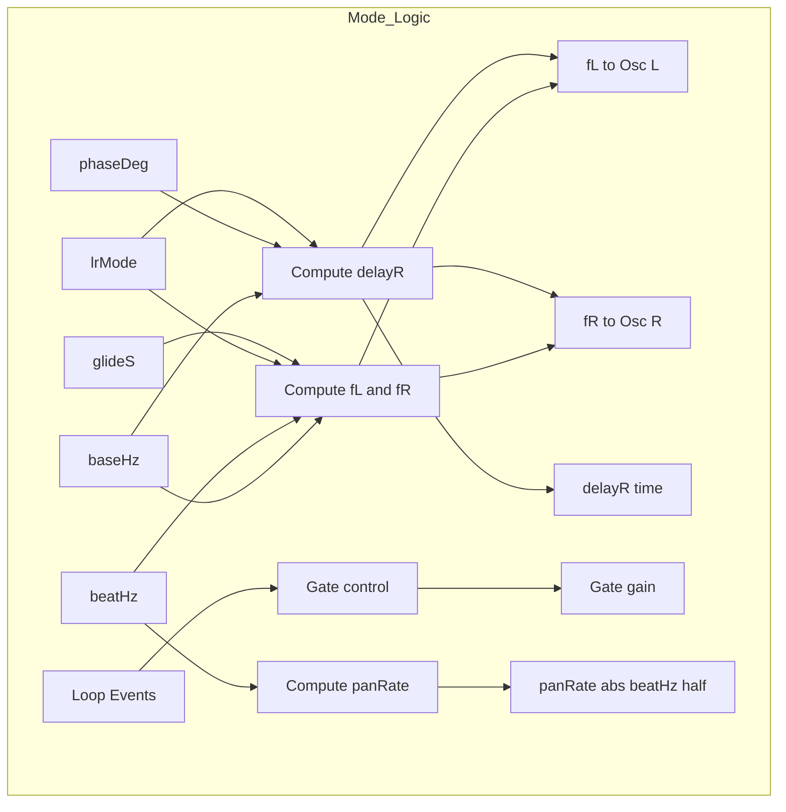

# Vibro Keyboard v2.5

Low-frequency stereo synthesizer for tactile / vibro experiments with:

-   Beat mode (Δf stereo difference)
-   Phase mode (right-channel delay)
-   Loop recorder (Rec toggle + Play toggle)
-   Master Autopan (Pan LFO, rate = beat / 2)

------------------------------------------------------------------------

## Signal Architecture

Osc L/R → (Phase or Beat logic) → Stereo Merger → Master Gain →\
Pan LFO (stereo gain modulation) → Gate → Output

Pan is applied at master stereo level, so it does not interfere with
beat/phase generation logic.

------------------------------------------------------------------------

# Parameters

## Base Frequency (Hz)

Fundamental oscillator frequency.

-   Affects both channels equally.
-   Used as reference for phase delay calculation.

------------------------------------------------------------------------

## Mode

### Beat Mode

Stereo difference is created by frequency offset.

-   L = baseHz - beatHz / 2\
-   R = baseHz + beatHz / 2\
-   Beat frequency = \|Δf\|

### Phase Mode

Both channels use the same frequency.

-   R channel is delayed relative to L.
-   Delay = (phaseDeg / 360) \* period

------------------------------------------------------------------------

## Beat Hz

Frequency difference between L and R in Beat mode.

-   Pan LFO rate = beatHz / 2
-   If beatHz = 0 → no autopan movement

------------------------------------------------------------------------

## Phase (deg)

Phase offset applied to right channel in Phase mode.

Displayed as: - Degrees - Equivalent delay in milliseconds

------------------------------------------------------------------------

## Glide (s)

Time constant for frequency transitions.

-   Uses exponential smoothing.
-   Affects note changes and loop playback.

------------------------------------------------------------------------

## Master Volume (0--1)

Controls final output gain.

Default: 0.5

------------------------------------------------------------------------

# Loop Recorder

## Rec loop (toggle)

-   First press → start recording
-   Second press → stop recording and finalize loop

Loop duration equals the time between first and last recorded event. No
artificial tail is added.

Recorded events: - gateOn (with hz) - setHz (glide moves) - gateOff

------------------------------------------------------------------------

## Play (toggle)

-   Starts loop playback
-   Press again to stop loop

Loop playback does not modify recorded events.

------------------------------------------------------------------------

# Pan LFO (Master Autopan)

Rate is automatically linked:

    panRate = beatHz / 2

This ensures one full left→right→left cycle per beat period.

Parameters:

## Enable

Turns autopan on/off.

## Depth (0--1)

Amount of stereo movement.

Gain mapping:

    pan = depth * sin(2π * rate * t + phase)
    gainL = 0.5 * (1 + pan)
    gainR = 0.5 * (1 - pan)

Depth 0 → centered\
Depth 1 → full L/R swing

## Phase (deg)

Initial phase of autopan LFO.

------------------------------------------------------------------------

# Design Principles

-   Deterministic loop playback
-   Separation of:
    -   Audio engine
    -   Loop engine
    -   UI layer
-   Minimal global coupling
-   Suitable for low-frequency tactile experimentation

------------------------------------------------------------------------

# Version

v2.5
